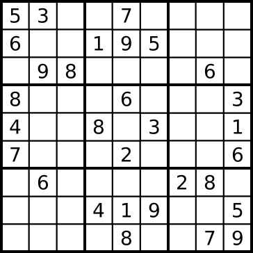

# Sudoku Solver
This program takes a valid sudoku board and returns the correct solution! It uses a backtracking algorithm to recursively solve any given board. All done in python!

## Instructions
To run the file just simply download the code, go to the correct directory and type the following:

```bash

python sudoku.py
```

## Demo

Here is a quick little visualization on how the backtracking algorithm works!




